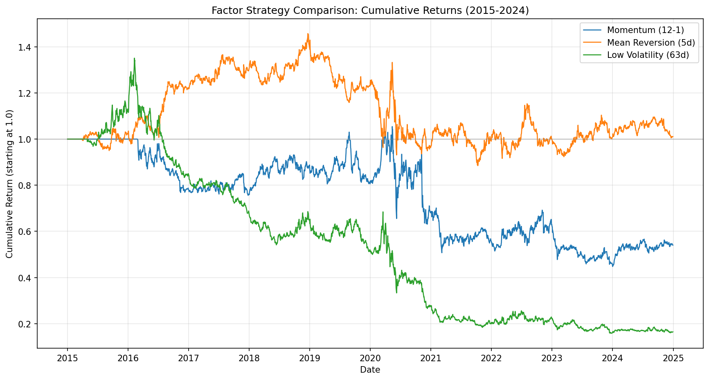
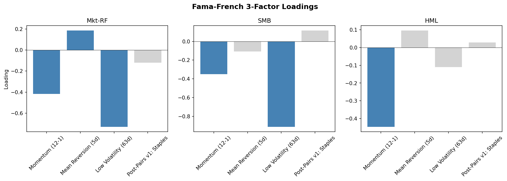
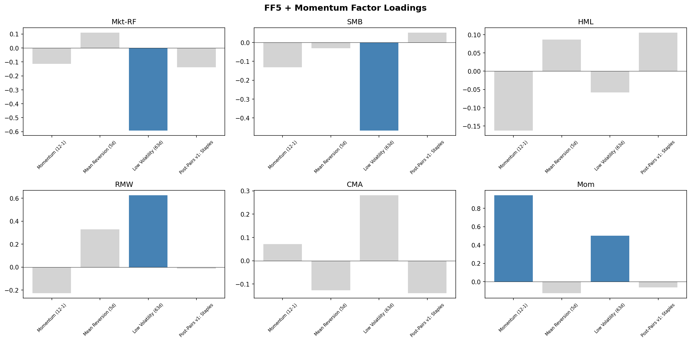
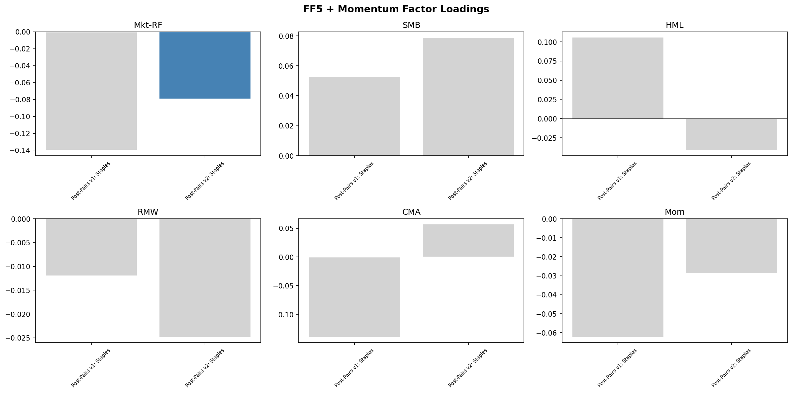

# Factor Attribution Report: Fama-French Analysis and OU Filter Evaluation

**Project:** Equity Factor Research
**Date:** May 2026
**Sample period:** January 2015 – December 2024 (120 months)
**Universe:** 462 S&P 500 constituents (as of 2024)

---

## 1. Executive Summary

This report presents the results of Fama-French factor attribution analysis on four trading strategies: Momentum (12-1 month), Mean Reversion (5-day), Low Volatility (63-day), and a Basket Statistical Arbitrage strategy on Consumer Staples stocks. Each strategy is evaluated under two attribution frameworks — the classic FF 3-factor model (Mkt-RF, SMB, HML) and the expanded FF 5-factor + Momentum model (adding RMW, CMA, UMD) — to identify the sources of returns, compare explanatory power, and assess whether any strategy generates genuine alpha. A separate analysis evaluates the impact of adding Ornstein-Uhlenbeck quality filters to the Consumer Staples strategy (v1 → v2).

Key findings:

- **Momentum** is almost perfectly explained by the UMD factor (loading 0.94), but underperforms the standard momentum premium by ~6.5% annually — suggesting implementation drag from universe composition and rebalance mechanics.
- **Mean Reversion** is orthogonal to all six factors (R² < 0.10), confirming that short-term reversal is a distinct return source not captured by any standard academic factor.
- **Low Volatility** has significant negative alpha under both models (-10.2% under FF3, -15.0% under FF6), driven by catastrophic losses from shorting structural breakout stocks (NVDA, TSLA, AMD).
- **Consumer Staples Stat Arb (v1)** shows zero exposure to all six factors (R² = 0.07, adjusted R² = -0.12), with an annualised alpha of 3.7% that is not statistically significant due to limited sample size (36 months out-of-sample).
- **Consumer Staples Stat Arb (v2)** — adding OU-based filters (mean-reversion speed, ADF stationarity) — destroys v1's positive alpha and introduces a significant negative alpha of -4.16% (p = 0.041). The filters also inject market factor exposure that did not exist in v1. The current filter design is demonstrably harmful for this sector and should not be used in its present form.

---

## 2. Strategy Performance Summary

| Strategy | Ann. Return | Ann. Volatility | Sharpe Ratio | Max Drawdown | Days Active |
|---|---|---|---|---|---|
| Momentum (12-1) | -5.98% | 23.14% | -0.26 | -57.55% | 100% |
| Mean Reversion (5d) | 0.11% | 16.01% | 0.01 | -39.28% | 100% |
| Low Volatility (63d) | -16.54% | 25.24% | -0.66 | -88.28% | 100% |
| Post-Pairs v1: Staples | 6.04% | 10.75% | 0.56 | -10.90% | 87% |
| Post-Pairs v2: Staples | -1.85% | 2.73% | -0.68 | -8.89% | 22% |

Only the Consumer Staples basket strategy produced positive risk-adjusted returns in this period. The remaining three cross-sectional factor strategies all posted negative Sharpe ratios over the 2015–2024 sample, a period characterised by persistent growth/mega-cap outperformance, a sharp momentum crash during COVID-19 (March 2020), and an unprecedented technology bull market that punished any strategy with short exposure to high-volatility names.

*Figure 1: Cumulative returns of the three cross-sectional factor strategies (2015–2024). Mean Reversion hovers around breakeven, Momentum suffers a permanent drawdown post-2020, and Low Volatility experiences near-total capital destruction.*

---

## 3. Fama-French 3-Factor Attribution

The 3-factor model uses the three original Fama-French (1993) factors:

- **Mkt-RF**: Market excess return (equity market minus risk-free rate)
- **SMB**: Small Minus Big (small-cap minus large-cap returns)
- **HML**: High Minus Low (value minus growth returns)

### 3.1 Results

| | Momentum (12-1) | Mean Reversion (5d) | Low Volatility (63d) | Staples Stat Arb |
|---|---|---|---|---|
| **Alpha (monthly)** | -0.229% | -0.237% | -0.849% | 0.318% |
| **Alpha (annualised)** | -2.74% | -2.85% | -10.18% | 3.82% |
| **Alpha p-value** | 0.579 | 0.504 | **0.031** | 0.516 |
| **Mkt-RF** | **-0.417** (p=0.000) | **0.185** (p=0.021) | **-0.731** (p=0.000) | -0.120 (p=0.235) |
| **SMB** | **-0.351** (p=0.022) | -0.108 (p=0.411) | **-0.914** (p=0.000) | 0.116 (p=0.476) |
| **HML** | **-0.447** (p=0.000) | 0.096 (p=0.299) | -0.109 (p=0.280) | 0.029 (p=0.792) |
| **R²** | 0.331 | 0.054 | 0.583 | 0.051 |
| **Adj R²** | 0.313 | 0.029 | 0.572 | -0.035 |

*Bold loadings are statistically significant at p < 0.05.*

*Figure 2: Fama-French 3-factor loadings across all four strategies. Blue bars indicate statistical significance (p < 0.05), grey bars are not significant.*

### 3.2 Interpretation Under FF3

**Momentum (12-1):** All three loadings are significantly negative. Mkt-RF of -0.42 means the strategy behaves as a partial short on the market. SMB of -0.35 reflects a tilt toward large-cap stocks (past winners in this period were predominantly mega-caps). HML of -0.45 indicates a strong growth tilt — the strategy buys past winners (growth stocks in 2015–2024) and shorts past losers (value stocks). Alpha is not significant, suggesting these factor exposures fully account for the strategy's negative returns. However, R² of 0.33 indicates that two-thirds of the return variation remains unexplained — a sign that the 3-factor model is missing something important.

**Mean Reversion (5d):** The model has almost no explanatory power (R² = 0.054). Only Mkt-RF is marginally significant at 0.185, meaning the strategy carries slight net-long market exposure. SMB and HML are both insignificant. This confirms that short-term price reversal is a fundamentally different phenomenon from the cross-sectional factors FF3 captures. Alpha is not significant, but this reflects the strategy's near-zero returns rather than factor explanatory power.

**Low Volatility (63d):** The strongest FF3 fit (R² = 0.583). Mkt-RF of -0.73 and SMB of -0.91 are both highly significant. The strategy is effectively short the market and heavily short small-cap — because the short leg consists of high-volatility stocks (NVDA, TSLA, AMD) that happen to be large-caps, not small-caps, the negative SMB loading actually indicates the strategy is long large-cap, low-vol stocks and short large-cap, high-vol stocks. Alpha is significantly negative at -10.18% (p = 0.031), meaning the strategy loses more money than its factor exposures would predict. The excess loss comes from shorting stocks that experienced structural, once-in-a-decade breakouts (the AI revolution) — a phenomenon no factor model captures.

**Consumer Staples Stat Arb:** All three loadings are insignificant and close to zero. R² of 0.051 and adjusted R² of -0.035 indicate the 3-factor model has zero explanatory power for this strategy. Alpha is positive at 3.82% annualised but not statistically significant (p = 0.516). This result raises a key question: is the strategy truly orthogonal to known factors, or is the sample simply too small to detect any relationship?

---

## 4. FF5 + Momentum (6-Factor) Attribution

The 6-factor model adds three factors to the FF3 base:

- **RMW**: Robust Minus Weak (high operating profitability minus low)
- **CMA**: Conservative Minus Aggressive (low investment minus high investment)
- **Mom (UMD)**: Up Minus Down (past 12-month winners minus losers, excluding most recent month)

### 4.1 Results

| | Momentum (12-1) | Mean Reversion (5d) | Low Volatility (63d) | Staples Stat Arb |
|---|---|---|---|---|
| **Alpha (monthly)** | -0.543% | -0.270% | -1.249% | 0.310% |
| **Alpha (annualised)** | -6.52% | -3.24% | -14.99% | 3.73% |
| **Alpha p-value** | **0.049** | 0.451 | **0.001** | 0.552 |
| **Mkt-RF** | -0.115 (p=0.084) | 0.110 (p=0.202) | **-0.593** (p=0.000) | -0.140 (p=0.203) |
| **SMB** | -0.131 (p=0.267) | -0.031 (p=0.841) | **-0.467** (p=0.002) | 0.053 (p=0.805) |
| **HML** | -0.163 (p=0.128) | 0.086 (p=0.535) | -0.058 (p=0.669) | 0.106 (p=0.636) |
| **RMW** | -0.228 (p=0.118) | 0.329 (p=0.085) | **0.625** (p=0.001) | -0.012 (p=0.960) |
| **CMA** | 0.072 (p=0.649) | -0.127 (p=0.537) | 0.281 (p=0.164) | -0.140 (p=0.629) |
| **Mom** | **0.942** (p=0.000) | -0.127 (p=0.223) | **0.501** (p=0.000) | -0.062 (p=0.677) |
| **R²** | 0.724 | 0.099 | 0.685 | 0.070 |
| **Adj R²** | 0.709 | 0.052 | 0.668 | -0.116 |

*Bold loadings are statistically significant at p < 0.05.*

*Figure 3: FF5 + Momentum factor loadings across all four strategies. Blue bars indicate statistical significance (p < 0.05), grey bars are not significant.*

### 4.2 Interpretation Under FF6

**Momentum (12-1):** The UMD loading of 0.94 (p = 0.000) dominates, and R² jumps from 0.33 to 0.72. This is the single most important result in the entire attribution: the strategy's return is almost perfectly explained by the academic momentum factor. The near-unit loading confirms that the implementation correctly captures the momentum premium. However, alpha is now significantly negative at -6.52% (p = 0.049). Since the FF momentum factor was positive over this period while the strategy was negative, the gap represents implementation drag — likely caused by the constrained S&P 500 universe (which includes more mid-caps subject to sharper momentum crashes, particularly around COVID-19) and monthly rebalancing frequency.

Notably, HML drops from significant (-0.45) under FF3 to insignificant (-0.16) under FF6. This is a textbook case of omitted variable bias: in the 3-factor model, HML was forced to proxy for the missing momentum factor because momentum and growth were highly correlated in this period. Adding UMD corrects this distortion.

**Mean Reversion (5d):** R² rises only marginally from 0.054 to 0.099. No factor is significant at the 5% level. RMW approaches significance (0.329, p = 0.085), hinting that mean reversion signals may be slightly more effective among high-profitability stocks, but the evidence is weak. The strategy remains almost entirely unexplained by any combination of known factors. This is a positive signal for the strategy's potential: if the rebalancing frequency issue (5-day signal with monthly execution) can be resolved and the strategy generates positive returns, those returns would likely represent genuine alpha that cannot be replicated by passive factor exposure.

**Low Volatility (63d):** R² increases from 0.58 to 0.69 with two new significant loadings. RMW of 0.63 (p = 0.001) shows that the long leg of the strategy (low-vol stocks) consists of highly profitable companies — mature businesses with stable cash flows. Mom of 0.50 (p = 0.000) indicates that low-volatility stocks in this period also happened to be past winners, creating an unintended momentum tilt. Despite these additional explanatory factors, alpha worsens from -10.18% to -14.99% (p = 0.001). The more factors we add, the more anomalous the strategy's losses become. The explanation is straightforward: shorting NVDA, AMD, and TSLA during the AI revolution produced losses that transcend any systematic factor framework. This was an idiosyncratic, structural event.

**Consumer Staples Stat Arb:** All six loadings are insignificant. R² rises negligibly from 0.051 to 0.070, and adjusted R² drops further to -0.116 (negative, indicating the model is worse than a simple mean). Alpha remains at 3.73% annualised (p = 0.552).

The Buffett hypothesis — that this strategy's returns would be explained by RMW (profitability) and CMA (conservative investment), the same factors that explain Berkshire Hathaway's alpha per Frazzini, Kabiller & Pedersen (2018) — is not supported. RMW loading is -0.01, essentially zero.

However, this does not invalidate the hypothesis. The RMW factor measures cross-sectional differences between high-profitability and low-profitability stocks. This strategy does not select stocks cross-sectionally: all five Consumer Staples stocks (KO, PEP, PG, CL, KHC) are high-profitability companies. The strategy trades mean reversion *within* this group, going long and short high-RMW stocks simultaneously. The net RMW exposure cancels out by construction. The correct test of the Buffett hypothesis requires a different approach — perhaps comparing the strategy's performance conditional on sector-level quality characteristics rather than using FF factor regressions.

---

## 5. FF3 vs FF6: Comparative Analysis

### 5.1 Explanatory Power (R²)

| Strategy | FF3 R² | FF6 R² | Δ R² | Primary Driver of Improvement |
|---|---|---|---|---|
| Momentum (12-1) | 0.331 | 0.724 | **+0.393** | UMD (0.94) |
| Mean Reversion (5d) | 0.054 | 0.099 | +0.045 | None significant |
| Low Volatility (63d) | 0.583 | 0.685 | +0.102 | RMW (0.63), Mom (0.50) |
| Staples Stat Arb | 0.051 | 0.070 | +0.019 | None significant |

The 6-factor model provides a dramatically better fit for the Momentum strategy and a meaningfully better fit for Low Volatility. For Mean Reversion and Consumer Staples Stat Arb, neither model has explanatory power, and the additional factors add noise rather than signal (evidenced by declining adjusted R²).

### 5.2 Alpha Stability

| Strategy | FF3 Alpha | FF3 p-value | FF6 Alpha | FF6 p-value | Direction |
|---|---|---|---|---|---|
| Momentum (12-1) | -2.74% | 0.579 | -6.52% | **0.049** | Worsened, became significant |
| Mean Reversion (5d) | -2.85% | 0.504 | -3.24% | 0.451 | Stable |
| Low Volatility (63d) | -10.18% | **0.031** | -14.99% | **0.001** | Worsened significantly |
| Staples Stat Arb | 3.82% | 0.516 | 3.73% | 0.552 | Stable |

For strategies with significant factor exposures (Momentum and Low Volatility), adding more factors pushes alpha further negative. This is the expected behaviour: when a strategy's returns are largely explained by known factors, and those factors had positive returns in the sample period while the strategy had negative returns, additional factors reveal the strategy's underperformance was even worse than initially apparent.

For strategies with no factor exposures (Mean Reversion and Staples Stat Arb), alpha is unchanged across models. This consistency strengthens the case that these strategies' returns — positive or negative — originate from sources outside the standard factor framework.

### 5.3 Omitted Variable Bias: The HML Case Study

The Momentum strategy provides a clear demonstration of omitted variable bias (OVB) in factor models:

| Loading | FF3 | FF6 | Interpretation |
|---|---|---|---|
| HML | **-0.447** (p=0.000) | -0.163 (p=0.128) | Significant → Not significant |
| Mom | *not included* | **0.942** (p=0.000) | — |

Under FF3, HML appeared to be a significant negative driver of the Momentum strategy. This was misleading. In the 2015–2024 period, momentum and growth were highly correlated (past winners were predominantly growth/tech stocks). Without a momentum variable in the model, HML absorbed the momentum effect as a proxy, producing a spurious loading. Adding UMD in the 6-factor model corrected this, reducing HML to insignificance.

This result is a practical demonstration of why the 6-factor model is preferred: omitting known factors does not just reduce R² — it actively distorts the loadings of included factors, leading to incorrect conclusions about the strategy's risk exposures.

---

## 6. OU Filter Evaluation: Consumer Staples v1 vs v2

### 6.1 Background

The v1 Consumer Staples strategy trades every z-score deviation without filtering, achieving the only positive Sharpe ratio among all strategies tested. The v2 strategy adds three quality filters based on Avellaneda & Lee (2010): an Ornstein-Uhlenbeck mean-reversion speed threshold (κ > 252/30, i.e. half-life < 30 trading days), an ADF stationarity test (p < 0.10), and rolling re-estimation on a 60-day window. The s-score replaces the z-score as the signal, with entry at ±1.25 and exit at ±0.5. The intention is to distinguish tradeable noise from structural breaks and only trade when mean reversion is statistically supported.

### 6.2 Performance Comparison

| | v1 | v2 | Change |
|---|---|---|---|
| Ann. Return | 6.04% | -1.85% | Positive → Negative |
| Sharpe | 0.56 | -0.68 | Positive → Negative |
| Ann. Volatility | 10.75% | 2.73% | -75% |
| Max Drawdown | -10.90% | -8.89% | Slight improvement |
| Days Active | 87% | 22% | -65 pp |
| Trades | 67 | 61 | Slight decrease |

The filters reduced active trading time from 87% to 22%, effectively leaving the strategy in cash for more than three-quarters of the out-of-sample period. Individual stock pass rates were extremely low: PEP passed only 7% of the time, PG 13%, KO 18%, KHC 14%, and CL 28% (the highest). These are among the most stable, homogeneous stocks in the entire market — if they cannot consistently pass the filters, the filters are miscalibrated for this environment.

### 6.3 Factor Attribution Comparison (FF5 + Momentum)

| | v1 | v2 | Interpretation |
|---|---|---|---|
| **Alpha (annualised)** | 3.73% (p=0.552) | **-4.16% (p=0.041)** | Positive → Significant negative |
| **Mkt-RF** | -0.140 (p=0.203) | **-0.079 (p=0.026)** | Not significant → Significant |
| **SMB** | 0.053 (p=0.805) | 0.079 (p=0.245) | Not significant → Not significant |
| **HML** | 0.106 (p=0.636) | -0.041 (p=0.561) | Not significant → Not significant |
| **RMW** | -0.012 (p=0.960) | -0.025 (p=0.739) | Not significant → Not significant |
| **CMA** | -0.140 (p=0.629) | 0.057 (p=0.533) | Not significant → Not significant |
| **Mom** | -0.062 (p=0.677) | -0.029 (p=0.542) | Not significant → Not significant |
| **R²** | 0.070 | 0.196 | Increased |
| **Adj R²** | -0.116 | 0.035 | Increased |

*Figure 4: FF5 + Momentum factor loadings comparison between Post-Pairs v1 (no filter) and v2 (OU filter). v2 introduces a significant Mkt-RF loading that did not exist in v1.*

### 6.4 Diagnosis: Three Problems with the Current Filter

**Problem 1 — The filter introduces significant negative alpha.** v1 had positive alpha of 3.73% (not significant due to sample size). v2 has negative alpha of -4.16%, and it is significant (p = 0.041). The filter does not merely reduce trading opportunities — it systematically selects worse trades. The mechanism: the ADF test on a 60-day window can only reject the unit root null when spread fluctuations are unusually large. In a low-volatility sector like Consumer Staples, unusually large fluctuations tend to signal the onset of structural change (e.g., KHC fundamental deterioration), not a high-quality mean reversion opportunity. The filter's design assumption — that large spread movements in a stationary process are the best trading opportunities — inverts the reality of this sector, where large spread movements are precisely the ones least likely to revert.

**Problem 2 — The filter injects factor exposure that did not previously exist.** v1's Mkt-RF loading was -0.14 (p = 0.203, not significant). v2's Mkt-RF loading is -0.079 (p = 0.026, significant). R² nearly triples from 0.07 to 0.20. A strategy that was fully market-neutral now has a detectable short-market tilt. This means the filter's pass/fail decisions are correlated with market conditions — it tends to allow trading in certain market environments and block it in others, inadvertently creating market timing behaviour. A well-designed filter for a dollar-neutral strategy should not introduce systematic factor exposures; the fact that it does indicates the filter is responding to market-level signals rather than stock-level mean reversion quality.

**Problem 3 — Extreme over-filtering destroys capital efficiency.** With only 22% active days and annualised volatility of 2.73% (vs 10.75% for v1), the strategy's capital sits idle the vast majority of the time. Even if the filtered trades had been profitable, the capital efficiency would be poor. The 75% reduction in volatility is not "risk management" in any useful sense — it is the mechanical consequence of a filter that rejects nearly everything. For context, a 2.73% annualised volatility is comparable to holding cash in a money market fund. The filter has effectively transformed an active trading strategy into a mostly-idle allocation.

### 6.5 The Broader Context: Avellaneda & Lee's Original Design

The filter parameters are adapted from Avellaneda & Lee (2010), who designed them for a broad universe of US equities spanning multiple sectors with widely varying volatility profiles. Their universe included hundreds of stocks with heterogeneous characteristics, where structural decoupling was common and aggressive filtering was necessary to avoid catastrophic losses. The authors themselves noted that they "modulated the leverage coefficient on a sector-by-sector basis," acknowledging that a single set of parameters could not work uniformly across different market environments.

Applying these parameters without modification to a five-stock, single-sector basket of Consumer Staples — the lowest-volatility, most homogeneous corner of the equity market — represents a fundamental mismatch between the filter's design assumptions and the trading environment. The 60-day estimation window is too short for the slow-moving spreads in this sector; the kappa threshold (half-life < 30 days) may be appropriate for volatile tech stocks but is unnecessarily aggressive for Consumer Staples where half-lives are naturally longer; and the ADF test lacks statistical power on low-variance series in short windows.

### 6.6 Conclusion

The OU filter, as currently implemented, is demonstrably harmful to the Consumer Staples basket strategy. It kills positive alpha, introduces negative alpha, creates factor exposures that did not previously exist, and wastes capital on idle cash. The filter needs fundamental redesign before it can add value to this strategy. The specific direction of that redesign is deferred to a subsequent analysis.

It is worth noting that the filter does serve a useful purpose in other sectors: on Semiconductors, it reduced max drawdown from -75% to -14%; on Pharma, from -51% to -15%. The filter's failure is sector-specific, not universal. This reinforces the broader finding from this project: sector homogeneity determines everything. The same tool that protects against structural decoupling in heterogeneous sectors destroys alpha in homogeneous ones.

---

## 7. Statistical Limitations and Caveats

### 7.1 Sample Size

The Consumer Staples Stat Arb strategy uses a 3-year out-of-sample window (~36 monthly observations). With 6 regressors, this leaves only 29 degrees of freedom. A rough power calculation: to detect a 3.7% annualised alpha with 10.75% volatility at the 5% significance level with 80% power, approximately 70–80 monthly observations would be required. The current sample provides roughly 30–40% of the statistical power needed for reliable inference on the Staples strategy.

### 7.2 Adjusted R² as a Model Fit Diagnostic

The Consumer Staples Stat Arb has an adjusted R² of -0.116 under the 6-factor model. A negative adjusted R² indicates that the model performs worse than simply using the mean return as a predictor — the six factors are adding pure noise. This is not a failure of the strategy but rather confirms that FF factors are the wrong explanatory framework for intra-sector mean reversion signals.

### 7.3 Factor Model Limitations for Dollar-Neutral Strategies

Fama-French factors are designed to explain long-only, cross-sectional return differences. Dollar-neutral strategies (like the Staples Stat Arb) mechanically hedge out most systematic factor exposures. The near-zero loadings observed for the Staples strategy may therefore reflect the strategy's construction rather than a genuine absence of factor-related return drivers. Alternative attribution frameworks — such as decomposing returns into sector-level vs idiosyncratic components, or using intra-sector dispersion as a factor — may be more appropriate for this class of strategy.

### 7.4 Survivorship Bias

The universe consists of current S&P 500 constituents. 23 tickers that were delisted or acquired during the sample period (e.g., ATVI, SIVB, FRC) are excluded. This introduces survivorship bias that may affect factor loading estimates, particularly for SMB and HML, as delisted companies tend to be smaller and more distressed.

---

## 8. Conclusions and Next Steps

The factor attribution analysis yields five distinct conclusions, one per strategy:

1. **Momentum** is a pure UMD exposure with negative implementation alpha. The priority is understanding *why* the implementation underperforms the academic factor — universe composition (462 S&P 500 stocks vs full CRSP) and rebalancing frequency are the leading hypotheses.

2. **Mean Reversion** operates in a return space orthogonal to all known factors. This is the most promising strategy for alpha generation, contingent on solving the signal decay problem (5-day signal with monthly execution).

3. **Low Volatility** carries deeply negative alpha that worsens as more factors are added. The strategy is structurally incompatible with periods of concentrated technology outperformance. It may be viable in risk-off regimes (2000–2010), but regime-conditional deployment is beyond current scope.

4. **Consumer Staples Stat Arb (v1)** generates returns that no standard factor model can explain, but the sample is too small for statistical significance. Extending the out-of-sample period and testing across additional homogeneous sectors are the two highest-priority next steps.

5. **Consumer Staples Stat Arb (v2)** demonstrates that the OU-based filter regime from Avellaneda & Lee (2010), applied without sector-specific calibration, is actively harmful to the strategy. The filter kills positive alpha, introduces significant negative alpha, and creates unintended factor exposures. Filter redesign is required, with the key constraint being that any new filter must be validated against the v1 baseline using the same factor attribution framework presented in this report.

The upgrade from FF3 to FF6 proved its value primarily through the Momentum strategy, where it doubled explanatory power and revealed a textbook case of omitted variable bias. For strategies that are inherently orthogonal to systematic factors (Mean Reversion, Staples Stat Arb), the choice between FF3 and FF6 is immaterial — neither model has explanatory power. Nevertheless, the 6-factor model should be used as the default attribution framework, as it provides a more complete set of controls and avoids the OVB distortions demonstrated in Section 5.3. The v1 vs v2 comparison in Section 6 further demonstrates the value of factor attribution as a diagnostic tool: without it, one might conclude that v2 is simply "less profitable" than v1. Factor attribution reveals the deeper problem — that the filter fundamentally alters the strategy's factor profile and introduces systematic biases that did not previously exist.

---

## References

- Fama, E.F. and French, K.R. (1993). "Common Risk Factors in the Returns on Stocks and Bonds." *Journal of Financial Economics*, 33(1), 3–56.
- Fama, E.F. and French, K.R. (2015). "A Five-Factor Asset Pricing Model." *Journal of Financial Economics*, 116(1), 1–22.
- Carhart, M.M. (1997). "On Persistence in Mutual Fund Performance." *Journal of Finance*, 52(1), 57–82.
- Frazzini, A., Kabiller, D. and Pedersen, L.H. (2018). "Buffett's Alpha." *Financial Analysts Journal*, 74(4), 35–55.
- Avellaneda, M. and Lee, J.H. (2010). "Statistical Arbitrage in the US Equities Market." *Quantitative Finance*, 10(7), 761–782.
- Asness, C.S., Frazzini, A. and Pedersen, L.H. (2019). "Quality Minus Junk." *Review of Accounting Studies*, 24(1), 34–112.

---

*Factor data sourced from Kenneth French Data Library. Strategy returns computed using daily price data from yfinance with 10bps round-trip transaction costs.*
